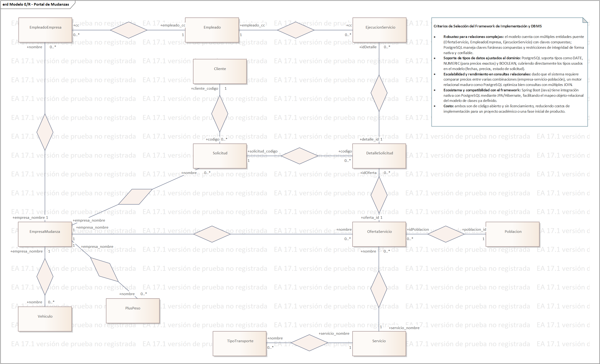

# Modelo de Persistencia — Entidad Relación (ERD)

**Proyecto:** Portal de Mudanzas (Base de Datos Relacional)[cite: 12, 14]  
**Autor:** Sebastián Villa Vargas  

---

## 🗄️ Modelo Entidad-Relación (ERD)

A continuación se detalla el modelo de entidad-relación diseñado para la persistencia de datos relacional[cite: 12]:

---

## 📋 Criterios de Selección del Framework de Implementación y DBMS

* **Robustez para relaciones complejas:** El modelo cuenta con múltiples entidades puente (`OfertaServicio`, `EmpleadoEmpresa`, `EjecucionServicio`) con claves compuestas. PostgreSQL maneja claves foráneas compuestas y restricciones de integridad de forma nativa y confiable[cite: 14].
* **Soporte de tipos de datos ajustados al dominio:** PostgreSQL soporta tipos como `DATE`, `NUMERIC` (para precios exactos) y `BOOLEAN`, cubriendo directamente los tipos usados en el modelo (fechas, precios, estado de solicitud)[cite: 14].
* **Escalabilidad y rendimiento en consultas relacionales:** Dado que el sistema requiere comparar precios entre varias combinaciones (`empresa`-`servicio`-`población`), un motor relacional maduro como PostgreSQL optimiza bien consultas con múltiples `JOIN`[cite: 14].
* **Ecosistema y compatibilidad con el framework:** Spring Boot (Java) tiene integración nativa con PostgreSQL mediante JPA/Hibernate, facilitando el mapeo objeto-relacional del modelo de clases ya definido[cite: 14].
* **Costo:** Ambos son de código abierto y sin licenciamiento, reduciendo costos de implementación para un proyecto académico o una fase inicial de producto[cite: 14].