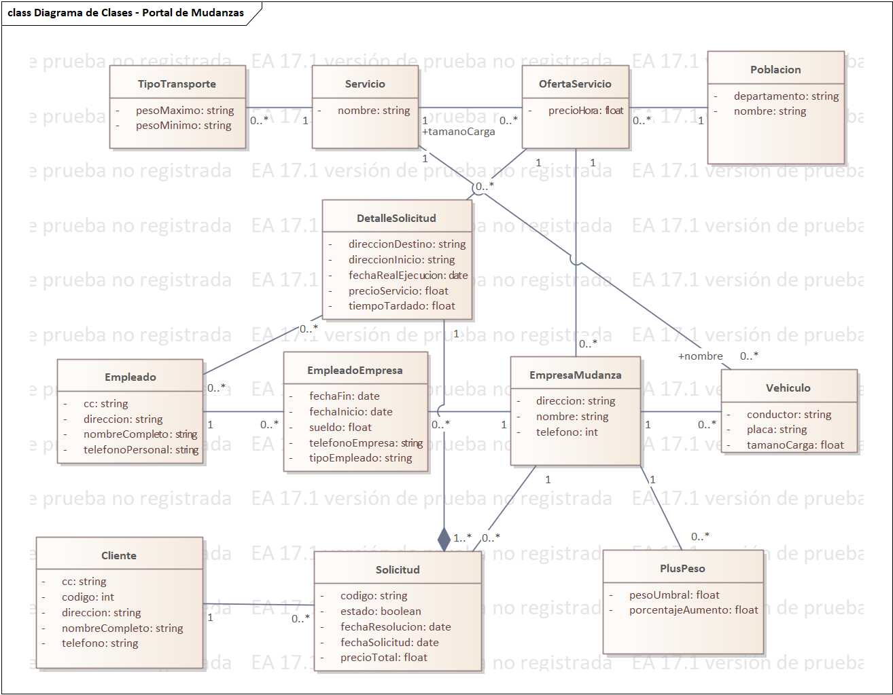

# Modelo Estructural — Diagrama de Clases UML

**Proyecto:** Portal de Mudanzas (Sistema de Gestión y Cotización)  
**Autor:** Sebastián Villa Vargas  

---

## 📐 Diagrama de Clases UML del Dominio

A continuación se presenta el modelo conceptual de clases del dominio, representando las entidades principales (*Cliente*, *Solicitud*, *DetalleSolicitud*, *EmpresaMudanza*, *Empleado*, *OfertaServicio*, *Poblacion*, *Vehiculo*, *PlusPeso*, *TipoTransporte*) y sus relaciones con multiplicidad[cite: 11]:

### Entidades y Atributos Clave
* **`Cliente`:** `cc`, `codigo`, `direccion`, `nombreCompleto`, `telefono`[cite: 11].
* **`Solicitud`:** `codigo`, `estado`, `fechaResolucion`, `fechaSolicitud`, `precioTotal`[cite: 11].
* **`DetalleSolicitud`:** `direccionDestino`, `direccionInicio`, `fechaRealEjecucion`, `precioServicio`, `tiempoTardado`[cite: 11].
* **`EmpresaMudanza`:** `direccion`, `nombre`, `telefono`[cite: 11].
* **`OfertaServicio`:** `precioHora`[cite: 11].
* **`PlusPeso`:** `pesoUmbral`, `porcentajeAumento`[cite: 11].