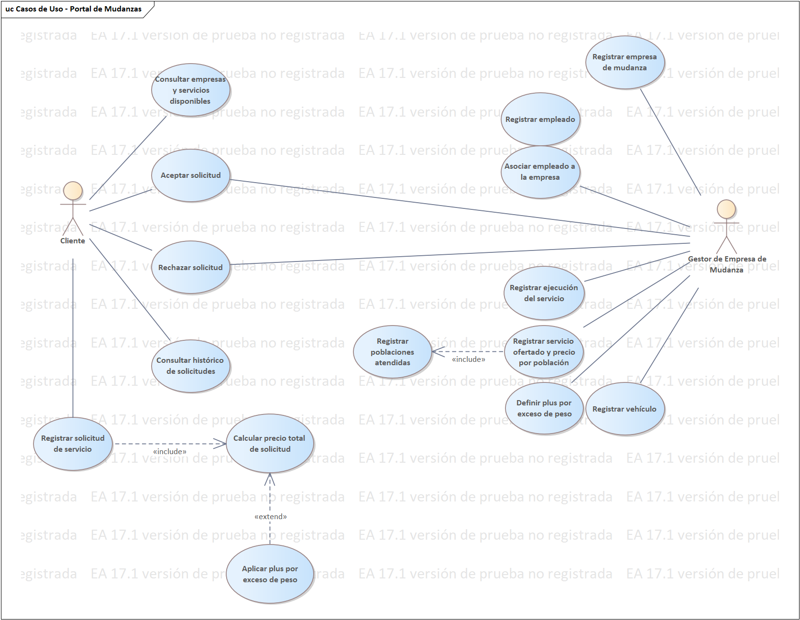

# Modelo de Casos de Uso — Portal de Mudanzas

**Proyecto:** Portal de Mudanzas[cite: 10]  
**Autor:** Sebastián Villa Vargas  

---

## 🔄 Diagrama de Casos de Uso del Sistema

A continuación se detallan las interacciones de los actores principales (*Cliente* y *Gestor de Empresa de Mudanza*) con el sistema[cite: 10]:

### Actores y Funcionalidades Principales

#### 👤 Cliente
* **Consultar empresas y servicios disponibles**[cite: 10].
* **Registrar solicitud de servicio** (que incluye automáticamente *Calculamiento de precio total*)[cite: 10].
* **Aceptar / Rechazar solicitud** propuesta[cite: 10].
* **Consultar histórico de solicitudes**[cite: 10].

#### 🏢 Gestor de Empresa de Mudanza
* **Registrar empresa de mudanza** y **Registrar empleado**[cite: 10].
* **Asociar empleado a la empresa**[cite: 10].
* **Registrar servicio ofertado y precio por población** (que incluye *Registrar poblaciones atendidas*)[cite: 10].
* **Definir plus por exceso de peso** (relación `«extend»` con cálculo de precio total)[cite: 10].
* **Registrar vehículo** y **Registrar ejecución del servicio**[cite: 10].